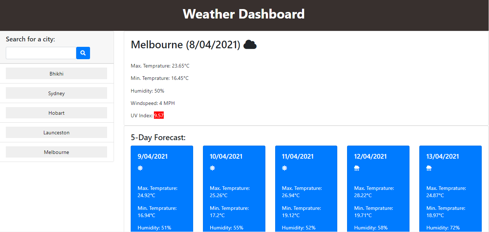

# Weather Dashboard

## Goals of the project :

`To build a Weather Dashboard, that displays weather of current day and next five days dynamically.`

## Table of Contents

- [Link of the website](#link-of-the-website)
- [Technologies Used](#technologies-used)
- [Screenshot of the website](#screenshot-of-the-website)
- [Got Any Questions](#got-any-questions)
- [License](#license)

## Link of the website:

https://tinkubansal95.github.io/weather-dashboard/

## Features

This application has the following features:

- Users can search weather for a city by entering the city's name or by clicking on any of the recent cities on the home page
- For the searched city, the application shows the city name, the date, an icon representation of weather conditions, the temperature, the humidity, the wind speed, and the UV index
- The application also presentes with a color for UC index that indicates whether the conditions are favorable, moderate, or severe
- The application also presents 5-day forecast for that city that displays the date, an icon representation of weather conditions, the temperature, and the humidity
- The application also displays the recent searched cities

## Technologies Used:

- JavaScript
- JQuery
- HTML
- CSS
- Bootstrap
- Moment.js API
- openweathermap API

## Screenshot of the website:

## Got Any Questions

Feel free to reach me through
tinkubansal21@gmail.com

## License

Licensed under the [MIT](https://github.com/tinkubansal95/weather-dashboard/blob/main/LICENSE) license.

---

© 2021
